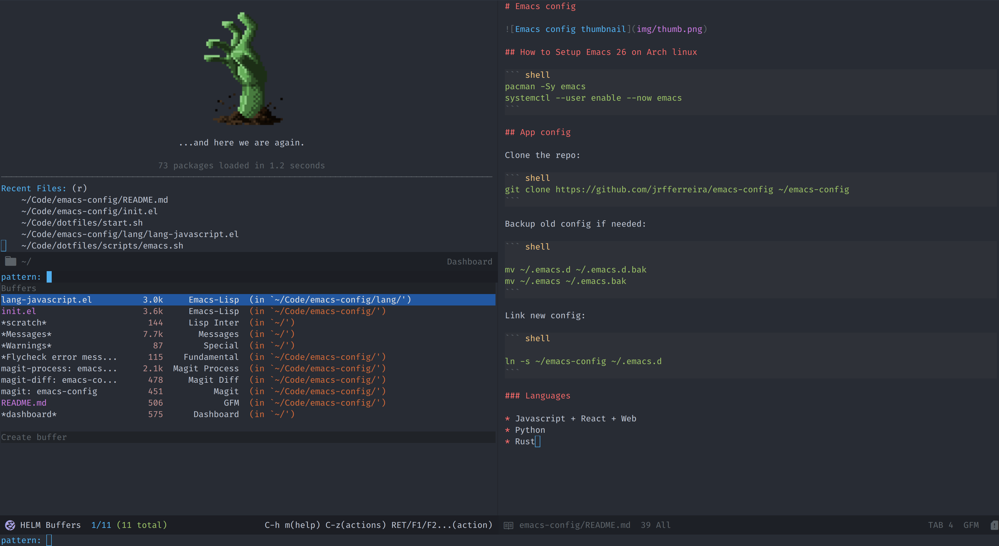

# Emacs config



## How to Setup Emacs 26 on Arch linux

``` shell
pacman -Sy emacs
systemctl --user enable --now emacs
```

## App config

Clone the repo:

``` shell
git clone https://github.com/jrfferreira/emacs-config ~/emacs-config
```

Backup old config if needed:

``` shell

mv ~/.emacs.d ~/.emacs.d.bak
mv ~/.emacs ~/.emacs.bak
```

Link new config:

``` shell

ln -s ~/emacs-config ~/.emacs.d
```

### Languages

* Javascript + React + Web
* Python
* Rust
